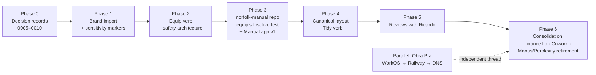

# ✨ Core-Stack Buildout — brand, verbs, manual, consolidation

## Overview

Turn the brainstormed core-stack (R1–R20, see origin) into a working system: brand assets imported, research verdicts locked as decision records, the **equip** and **tidy** verbs built with a machine-enforced safety architecture, the **Manual app** with its Update button shipped as equip's first live test, and the consolidation of Manus/Perplexity/Cowork begun. Ricardo's total workflow throughout: *say the verb, read a plain-English PR summary, click approve* (see origin: R7).

**Read this first when resuming:** the kit already carries a large *done* pile from the brainstorm session itself — R9 (plugins pinned in `.claude/settings.json`), R14 (AGENTS.md two-editor architecture), R15 launchers (8 drivers incl. new Gemini/Llama), the Owner's Guide, and the harvested/archived `norfolk-starter`. This plan sequences only what remains.

## Problem Statement

Every write path in this plan ultimately serves one person who cannot read diffs. The naive design ("agent writes changes, agent writes summary, owner approves summary") is circular trust — SpecFlow finding **C5**. The plan therefore builds the safety machinery *first-class*: a payload manifest, an org→payload mapping, sensitivity markers, and a blocking CI check that refuses brand-boundary violations regardless of what any summary says.

## Proposed Solution — the shape

## Resolved planning questions (deferred from origin — resolved here)

1. **Skill distribution (affects R2):** **Equip COPIES skills into each repo's `.claude/skills/`** — self-contained repos, no cross-org runtime dependency, fully documented mechanism (validated against Anthropic docs 2026-07-31). Update propagation is solved by the **manifest** (below), not by live-fetching. Kit-as-plugin-marketplace stays an optional future (pattern works — Ricardo's own env consumes EveryInc's repo-marketplace — but is undocumented officially; copying is provably right, per R13).
2. **Canonical layout source (affects R3):** **fresh minimal spec**, informed by H-Analytics (most mature) but not derived from it — H-A visibly carries legacy junk (`attached_assets/`, root-level sprawl seen 2026-07-30). Validate the draft against H-A's and obra-pia's real trees; **Ricardo blesses it before tidy ever runs** (origin R11b).
3. **Cross-org auth (affects R2/R8):** per SpecFlow **C6** — mint a **fine-grained PAT (read-only, norfolk-kit only)**, installed as an **org-level Codespaces secret** in Norfolk-Group, KIT-Capital, and the personal account. Equip pre-flights kit readability and prints plain-English recovery steps on failure. The interactive `gh auth login` dance becomes the fallback, not the mechanism. Never a broad token inside a client-org environment.
4. **Avatar canonical picks (affects R5):** chosen **with Ricardo during Phase 1 import** — several Synthesia variants exist; a 10-minute joint pass.

## Technical Approach

### The safety architecture (from SpecFlow — built in Phase 2, used by everything after)

| Control | What it does | Findings addressed |
|---|---|---|
| **`payloads.json` org→payload mapping** (in kit) | Explicit map: `Norfolk-Group` → full kit + Norfolk brand; `KIT-Capital` → tooling + KIT-family brand only; `ricardo-cidale-personal` → tooling only, zero brand; **any org not mapped (forks, no remote, multi-remote) → tooling-only + PR states why** | C1, C2 |
| **Sensitivity markers** — every kit file tagged `client-safe` / `norfolk-only` / `client:<id>` (manifest sidecar, not folder position) | Equip filters the payload by marker; folder location alone is never the boundary | C4 |
| **`kit-manifest.json`** written into every equipped repo (kit commit SHA + per-file hashes) | Re-equip updates kit-managed-unmodified files, flags kit-managed-but-edited as conflicts, never touches foreign files → **kit updates propagate; no permanent drift** | I1, I4, M5 |
| **Blocking CI check** (`kit-guard.yml`, shipped by equip) | Fails the PR if: diff touches files outside the machine-generated manifest; brand files violate the org mapping; deletions appear in an equip/tidy PR | **C5** (the load-bearing control), C3 |
| **Brand-boundary audit** in both verbs | Standing violations (e.g., repo transferred between orgs) surface as top-of-PR critical items | C3 |
| **Identity pre-flight** | Asserts `gh auth status` account + git author match the target org before any write | C7 |
| **Deterministic branch names** (`equip/<kit-sha>`, `tidy/<date>`) with resume-not-recreate semantics | Partial failures (push ok, PR failed; auth expiry mid-run) resume cleanly instead of orphaning | I3 |
| **Per-file-type merge strategy** | JSON configs deep-merge additively (existing keys win; required keys like the `neon` MCP block injected); prose/markdown never overwritten — kit version lands as `<name>.kit.md` + diff summary in PR body | I2 |
| **Concurrency guards** | Equip/tidy refuse to run while the other's PR is open; tidy excludes files touched by open feature PRs | I7 |
| **Deletions-only follow-up PRs** | Tidy PRs contain zero deletions; true deletions arrive separately so approval is unambiguous | I6 |
| **Reference-scan before moves** + green CI as merge precondition on tidy branches | Moves that would break imports/CI paths get rewritten in-PR or downgraded to "flagged" | I5 |
| **Empty-repo handling** | Zero-commit repos: initial commit created with explicit confirmation, then normal flow | M1 |
| **`archive/` exemption + aging** | Excluded from tidy audits; entries older than a set age listed in the deletions-only PR | M2 |
| **Tidy PR size cap** (batch by area; "risk items" before "safe items") | Keeps PRs reviewable by a human who reads summaries | M3 |

### Update-button safety (Phase 3, from SpecFlow)

- One in-flight run enforced by the app (button disabled + status shown); repeat presses update the single open kit-update PR (I8).
- Digest leads with a **per-provider status table** (checked / failed:reason / skipped); failed providers keep their old freshness stamps — never stamped fresh on failure (I9).
- Provider keys are Railway service secrets on Norfolk billing; every run has a hard cost cap; the digest includes a cost line (I10).
- Manual re-renders on merge webhook **at the exact merge-commit SHA**, shown in the app footer (M4); the app also lists equipped repos whose recorded kit SHA lags kit HEAD — "these repos are behind" in plain English (M5).

## Implementation Phases

### Phase 0 — Decision records 0005–0010 *(S · no Ricardo time)*
Distill the brainstorm's research verdicts into permanent records (origin: R10, R13, R14): 0005 hosting/Railway (incl. outage risk + mitigation), 0006 Supabase-not-adopted (+ revisit trigger), 0007 Voyage embeddings standard, 0008 Docker-invisible posture, 0009 two-editor architecture (AGENTS.md canonical), 0010 fleet doctrine (Claude baseline, 8 drivers, Lane A/B).
**Done when:** records exist, each with "What this rules out"; requirements doc R10 table references them.

### Phase 1 — Brand import *(M · needs THIS Windows machine + ~15 min of Ricardo)*
Curate the nine brands + two bonus venue logos from the mapped Dropbox sources into `brand/norfolk/` and `brand/clients/kit-capital/` (origin: R5 + org-structure decision), with sensitivity markers (C4) and a usage note per brand (dark/light variants, minimum sizes). Close the three gaps: KIT Partners `.ai` → PNG/SVG export; Rituel dark variant derived or requested; Colliers resolution verified. **With Ricardo:** avatar picks; bonus-logo yes/no; gap dispositions.
**Done when:** all brands in kit with markers; gaps closed or explicitly waived; core-stack.html brand table shows all-READY.

### Phase 2 — The equip verb + safety architecture *(L · the heart)* — **mostly built**
Build `payloads.json`, sensitivity markers file, the equip skill (SKILL.md, copied-not-fetched distribution), `kit-manifest.json` writer, `kit-guard.yml` CI check, identity pre-flight, PAT setup walk-through (one-time, with Ricardo), merge strategies, resume semantics. Test matrix: empty repo · messy repo · client-org repo · personal repo · unmapped org · re-equip after kit change · re-equip after local edit.
**Done when:** the full test matrix passes on scratch repos; a deliberately-planted brand violation is **rejected by CI**, not by vigilance.

**Built and verified (2026-07-31, commits `65a3828`, `a3a364f`):**

| Component | State |
|---|---|
| `.kit/payloads.json` — org→payload mapping (C1/C2) | ✅ built |
| `.kit/markers.json` — per-path sensitivity, `unmatchedDefault: norfolk-only` (C4) | ✅ built; moved out of `brand/` — it maps the whole repo, not just brand |
| `.kit/README.md` — plain-language explanation of the config layer | ✅ built |
| `tools/kit-guard/check.mjs` — 4 fail-closed rules (C5) | ✅ built, **5/5 scenarios verified** |
| `tools/kit-guard/write-manifest.mjs` — machine-generated manifest (C5/I1) | ✅ built, 2/2 verified |
| `.github/workflows/kit-guard.yml` — blocking PR check | ✅ built, not yet exercised on a real PR |
| `.claude/skills/equip/SKILL.md` — the procedure | ✅ written, **not yet run end-to-end** |

**Guard scenarios verified on a scratch repo:** norfolk asset into a client repo (caught twice, by two independent rules) · clean pass in Norfolk org · org-transfer standing violation caught with no diff · unmapped org restricted to tooling · deletion rejected. A malformed `--base` ref also fails closed rather than passing blind.

**Still open — the half that needs a live run:**
- The **equip test matrix** (empty · messy · client-org · personal · unmapped · re-equip after kit change · re-equip after local edit). Phase 3 is the first live equip, so the matrix runs against it rather than against throwaway repos.
- The **fine-grained PAT** as an org Codespaces secret (SpecFlow C6) — one sitting with Ricardo. Equip pre-flights for it and prints the fallback, so this blocks convenience, not correctness.
- `kit-guard.yml` has never run in GitHub Actions. First real PR is the test.

### What the first live equip found *(2026-07-31)*

`norfolk-manual` was created and equipped for real. The scratch-repo tests in Phase 2 all passed and were all correct — but they tested *whether the boundary holds*, and every one of these six defects is about *what ships* or *what the guard considers its business*. Only a real repo surfaces those.

| # | Defect | Would have caused | Fix |
|---|---|---|---|
| 1 | Kit's own plans/decisions/Owner's Guide marked `norfolk-only` | Copied into every Norfolk repo — forking the kit, the exact failure the Manual exists to prevent | `kit-only` marker; no org allows it |
| 2 | Brand tree in the payload | **180MB** into every repo | `$excludeFromPayload`; curated web sets deferred to Phase 4 |
| 3 | **`git` quotes non-ASCII paths** — the quoted form matches no pattern, so the file skipped *both* the scope and boundary rules | A silent, complete bypass. 20 files hit it here, all KIT Capital assets, and they were mid-copy into a Norfolk repo | Read NUL-separated output (`-z`) everywhere |
| 4 | `unmatchedDefault: norfolk-only` | Looks fail-closed, isn't — Norfolk-Group *allows* that sensitivity, so unmarked files ship silently there. This is what turned #3 from a caught error into a boundary crossing | `unmatchedDefault: kit-only` |
| 5 | `markers` conflated "paths the kit ships" with "paths the guard polices" | **No equipped repo could have its own README or its own `docs/plans/`** without CI going red | `$kitLocal`, excluded from `markers` |
| 6 | Manifest hashes computed on unnormalised line endings | Every cross-platform re-equip = one giant false conflict; the update mechanism silently useless | `.gitattributes` with `eol=lf` |
| 7 | **The CI job passed while the guard was failing.** `node check.mjs \| tee` returns *tee's* status under `bash -e` | The guard posted four violations to PR #1 and the run went green. Merge unblocked. Every control above was live and correct, and none of it mattered | `set -o pipefail` |

Finding 7 deserves its own line: everything upstream of it worked, and the whole apparatus was still inert. It was found only because the acceptance test planted a violation *deliberately* and someone checked the run status rather than the comment. A guard that reports correctly and exits wrongly is indistinguishable from a working one until the day it matters.

**Acceptance criterion met** — `norfolk-manual` PR [#1](https://github.com/Norfolk-Group/norfolk-manual/pull/1): planted KIT Capital asset → CI red, two rules firing; asset removed → CI green. Blocked by the machine, not by anyone reading a diff.

**The pattern worth keeping:** #3 was found only because the accented path made `mkdir` *crash*. Had the filename been merely unusual rather than unopenable, the file would have shipped and nothing would have complained. The lesson is not "handle unicode" — it is that a check keyed on pattern-matching fails open when the input is shaped unexpectedly, so the default for an unrecognised input must be the *most* restrictive value available (#4), never a plausible-looking middle one.

Kit commits: `d16ee5e`, `89e65d1`, `c88ada8`, `2d94d13`.

### Phase 3 — `norfolk-manual` + the Manual app v1 *(L · equip's first live test)*
Create the fresh repo → **equip it for real** (the zero-risk proving ground, origin R18) → build the app on the equipped foundation: renders kit content (rules, decisions, stack, fleet, build state, Owner's Guide) — **renderer, never a fork** — plus the Update button with the I8–I10/M4–M5 safety behaviors. Railway-hosted, tRPC (agent-native parity), no DB in v1.
**Done when:** Ricardo opens a URL, sees his always-current manual, presses Update, approves the resulting PR, and watches the manual re-render.

### Phase 4 — Canonical layout + the tidy verb *(M/L)*
Draft the fresh layout spec (resolved Q2) → validate against H-Analytics + obra-pia trees → **Ricardo blesses it** → build tidy with the I5/I6/I7/M2/M3 controls. First live runs: norfolk-kit itself, then one real repo of Ricardo's choosing.
**Done when:** a tidy PR on a real messy repo is approved by Ricardo without a single "what does this mean?" question (origin success criterion).

### Phase 5 — Reviews with Ricardo *(M · mostly his time, scheduled in ~3 short sessions)*
(a) Governance Rules read-through → amend → re-bless; (b) design-system.md populated with real standards (brand palettes from Phase 1, typography, motion vocabulary, forbidden patterns); (c) any remaining brand/canonical-pick blessings (origin: R11).
**Done when:** all three docs carry fresh `Last verified` stamps with Ricardo's sign-off noted.

### Phase 6 — Consolidation & seeds *(M · staged, partially parallel)*
- **Finance library seed** (origin R19): `finance` drawer with NPV/IRR/amortization/cap-rate/scenario primitives, honestly tested; first consumer wired (H-Analytics returns or Obra Pía scenarios).
- **Cowork inventory + first migration** (origin R20): list Cowork projects, migrate one as the pattern-setter, record its default-driver assignment in its AGENTS.md.
- **Manus retirement** (origin R17a): blocked by Obra Pía cutover (parallel thread); then cancel + log saving.
- **Perplexity retirement** (origin R17b): write the research playbook into the kit (quick-lookup vs deep-research phrasing); Ricardo trials 2 weeks; cancel + log saving.
- **Kit hardening** (origin R14 validation gaps): path-scoped `.claude/rules/`, hooks, output styles.
- **Office routing** (origin R17c): document the docx/pptx/xlsx skill workflows in the Owner's Guide.

### Parallel thread (separate plan, referenced): Obra Pía
WorkOS auth swap on `feat/workos-auth` (Codespace, prompt ready) → full auth review (touches auth ⇒ mandatory) → Railway deploy → investor testing → DNS cutover → Manus cancellation unlocks Phase 6's first saving.

## System-Wide Impact

- **Interaction graph:** equip PR → `kit-guard.yml` CI → advisory review bot (per Ricardo's ci-review rule) → Ricardo approve → merge → manifest recorded → Manual app "repos behind" list updates. Update button → agent run → kit PR → merge webhook → manual re-render.
- **Error propagation:** every flow's partial-failure lands as *resumable state with a plain-English report* (deterministic branches), never orphaned artifacts; provider failures degrade to status-table entries, never silent freshness.
- **State lifecycle risks:** the manifest is the single state record per repo; a repo without one is by definition un-equipped (safe default). Archive/ is append-only with aging into deletions-only PRs.
- **API surface parity:** finance primitives exposed identically to UI, MCP agents, and reports (R19) — one calculator.
- **Integration tests that unit tests can't catch:** the Phase 2 test matrix (7 scenarios) + planted-violation CI rejection + a full equip→tidy→re-equip cycle on one scratch repo.

## Acceptance Criteria

- [ ] Equipping any repo ≤ 10 minutes of Ricardo's attention (07-30 baseline: ~1 hour) — origin success criterion
- [ ] A planted brand-boundary violation is blocked by CI, not by review vigilance (C5)
- [ ] Re-equip after a kit change updates unmodified kit files and flags edited ones (I1)
- [ ] Client-org repo payload contains zero `norfolk-only`-marked files (C4, verified by CI)
- [ ] Tidy PR on a real repo approved without clarification questions; zero deletions in-PR (I6)
- [ ] Manual app renders from kit at pinned SHA; Update button produces one PR with provider status table + cost line
- [ ] Each retired subscription's saving recorded in the SaaS tracker
- [ ] Every phase updates the relevant HTML artifact (origin: R12) — prose-only reporting fails the phase

## Dependencies & Risks

| Risk | Mitigation |
|---|---|
| Fine-grained PAT setup is a one-time fiddly step for a non-programmer | Phase 2 includes a walked-through session; fallback remains the guided `gh auth login` |
| `.ai` → PNG/SVG export for KIT Partners may need Illustrator | Try programmatic conversion first; else a 2-minute export on Ricardo's machine, guided |
| Railway reliability (44 incidents/90d on record) affects the Manual app | Manual is read-mostly + non-critical; content source of truth stays in GitHub |
| Scope gravity — R-list grew 20 items in one day | This plan is the freeze line; new ideas enter a *next* brainstorm, not this plan |
| Cowork project inventory is unknown territory | Phase 6 starts with inventory-only; migration decisions per-project with Ricardo |

## Sources & References

### Origin
- **Origin document:** [docs/brainstorms/2026-07-31-core-stack-requirements.md](../brainstorms/2026-07-31-core-stack-requirements.md) — all R1–R20 mapped into phases above. Key decisions carried forward: Claude Code as courier + PR-only writes (R2/R7); org-aware payloads with Norfolk/client boundary (Key Decisions); two-verbs-separate (R4); Manual-renders-kit-never-forks (R18); server-side finance (R19).
- Requirements marked already-done in origin and *not* re-planned: R9, R14 (applied 2026-07-31), R15 launchers, R1/R13 as standing policy.

### Internal
- SpecFlow analysis (this plan's session, 2026-07-31): findings C1–C7, I1–I10, M1–M5 — all incorporated above.
- Kit decision records: `docs/decisions/0001–0004`; consolidation plan `docs/plans/2026-07-29-kit-consolidation.md` (harvest/archive: done).
- Owner's Guide: `docs/OWNERS-GUIDE.md` · Visual overview: `docs/artifacts/core-stack.html`.

### External (verified during brainstorm, cited in origin/research outputs)
- Anthropic Claude Code docs (memory, settings, skills, MCP, devcontainer) · Cursor rules/MCP docs · agents.md spec · Railway/Neon/Supabase/Voyage/OpenRouter official pricing & catalogs (July 2026).
